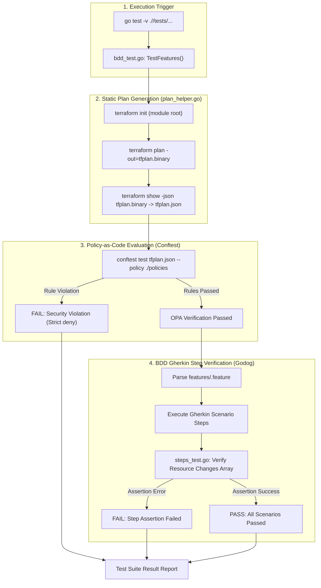

# Detailed Overview of the Modular Test Framework & Architecture

This document provides a comprehensive technical overview of the refactored modular test framework implemented across the repository. It details the testing philosophy, toolchain integration, requirement traceability, step-by-step execution logic, and architectural design.

---

## 1. Architectural Philosophy & Principles

The framework is engineered around four core design principles:

1. **Modular Isolation**: Each Terraform module in the project root owns a self-contained `tests/` directory. Tests run exclusively against that module’s local directory without importing, scanning, or depending on other modules.
2. **Strict Compliance Enforcement**: Policy-as-Code rules strictly enforce security and architecture standards from [tests/requirement.md](tests/requirement.md). Policies use strict `deny` rules to flag non-compliant code.
3. **Requirement Traceability**: Every BDD feature and scenario is explicitly tagged with formal Requirement IDs (e.g. `@CR.SECURITY.009`, `@CR.SECURITY.034`, `@CR.ARCHITECTURE.001`), linking code checks directly to compliance requirements.
4. **Fast, Low-Cost Execution**: Static plan evaluation (`@opa`) executes in **~2-10 seconds per module** with **$0 GCP cloud resource costs** by inspecting HCL plan outputs before live deployment.

---

## 2. Toolchain Ecosystem & Capabilities

| Tool | Role in Framework | Responsibilities & Capabilities |
| :--- | :--- | :--- |
| **Go (`testing`)** | Test Harness & Execution Engine | Orchestrates test discovery, sub-test execution (`go test -v ./...`), and provides standard assertion and reporting frameworks. |
| **Godog (Cucumber for Go)** | BDD Scenario Runner | Parses Gherkin `.feature` files, maps Gherkin steps (`Given`, `When`, `Then`) to Go step definitions, and enforces tag filtering (`-godog.tags`). |
| **Conftest / Open Policy Agent (OPA)** | Policy-as-Code Engine | Evaluates Rego policy rules (`.rego`) against HCL plan JSON objects offline, producing standard `PASS`/`FAIL` security violation reports. |
| **Terraform CLI** | Infrastructure Plan Generator | Executes `terraform init`, `terraform plan -out=tfplan`, and `terraform show -json tfplan` to produce machine-readable resource change graphs. |
| **Terratest** | Go Helper Library | Manages background shell execution, environment variable injection (`GOOGLE_CLOUD_PROJECT`), temporary plan file cleanup, and optional live infrastructure lifecycle hooks (`@live`). |

---

## 3. Requirement Traceability & Mapping Matrix

Every requirement in [tests/requirement.md](tests/requirement.md) maps to specific Rego rules and BDD scenarios:

| Requirement ID | Domain / Standard | Target Resources | Enforced Rules & Assertions |
| :--- | :--- | :--- | :--- |
| **`CR.SECURITY.009`** | Data at Rest CMEK Encryption | `google_logging_project_bucket_config`, `google_bigquery_dataset`, `google_kms_crypto_key` | Denies resources missing `cmek_settings` or `default_encryption_configuration`. Enforces KMS key rotation $\le 365$ days. |
| **`CR.SECURITY.034`** | IAM Least Privilege | `google_bigquery_dataset_iam_member`, `google_kms_crypto_key_iam_member` | Denies wildcard action grants (`*`) in IAM roles or bindings. Requires explicit permission enumeration. |
| **`CR.SECURITY.035`** | Custom Roles for Control Plane | `google_service_account`, `google_bigquery_dataset_iam_member` | Restricts service accounts from taking non-explicit or broad control plane roles. |
| **`CR.SECURITY.037`** | Storage/Logging Public Access Prevention | `google_logging_project_bucket_config`, `google_bigquery_dataset_iam_member` | Denies public principal access (`allUsers`, `allAuthenticatedUsers`) on bucket or dataset IAM bindings. |
| **`CR.ARCHITECTURE.001`** | GA Services & Location Controls | `google_org_policy_policy`, `google_project_service`, `google_observability_trace_scope` | Enforces General Availability (GA) APIs (`monitoring.googleapis.com`) and non-empty location policy lists (`gcp.resourceLocations`). |
| **`CR.SECURITY.002`** | Data in Transit Encryption | `google_monitoring_alert_policy`, endpoints | Enforces HTTPS/TLS 1.2+ endpoint schemes and active monitoring alert conditions. |

---

## 4. End-to-End Test Execution Pipeline



---

## 5. Per-Module File Structure & Testing Logic

Each module’s `tests/` directory implements a standard 5-file architecture:

```
<module_name>/
  └── tests/
      ├── bdd_test.go       # Suite entry point (godog.TestSuite runner)
      ├── plan_helper.go    # Runs terraform plan -> show -json -> conftest
      ├── steps_test.go     # Go functions bound to Gherkin Given/When/Then steps
      ├── features/
      │   └── <module>.feature   # BDD scenarios tagged with Requirement IDs
      └── policies/
          └── <module>_policy.rego # Rego rules for static JSON plan inspection
```

### Detailed Testing Logic Flow

1. **Before Scenario Hook (`bdd_test.go`)**:
   - Before executing a scenario, `generateModulePlanJSON(t)` initializes the parent Terraform module (`..`), runs `terraform plan`, and serializes the plan to `tfplan.json`.
   - `runConftestAgainstModule(t)` invokes `conftest test tfplan.json --policy ./policies`.
   - If any Rego rule triggers a `deny`, the test suite fails immediately with an explicit error output.

2. **Gherkin Step Verification (`steps_test.go`)**:
   - The unmarshaled `ResourceChanges` slice (`PlanResourceChange` struct) is passed to Go step handlers.
   - Handlers inspect specific attributes (e.g. `role`, `member`, `cmek_settings`, `rotation_period`) to verify compliance against the scenario assertions.

3. **Result Compilation (`go test`)**:
   - Returns standard Go test status (`PASS` / `FAIL`), execution duration, and scenario statistics.
